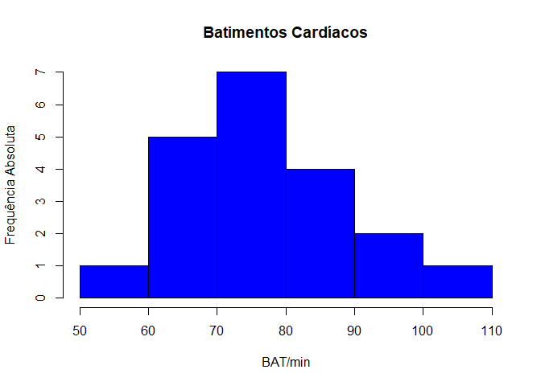
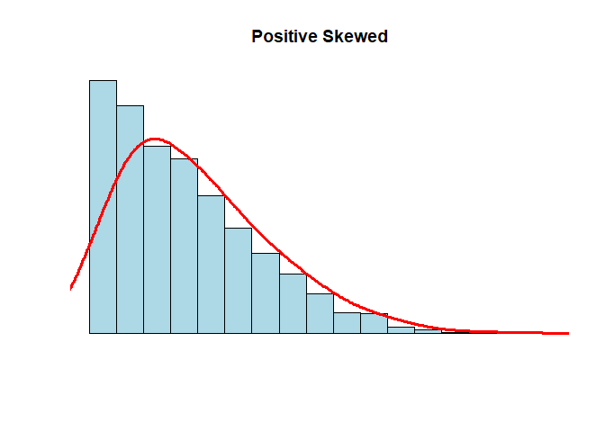
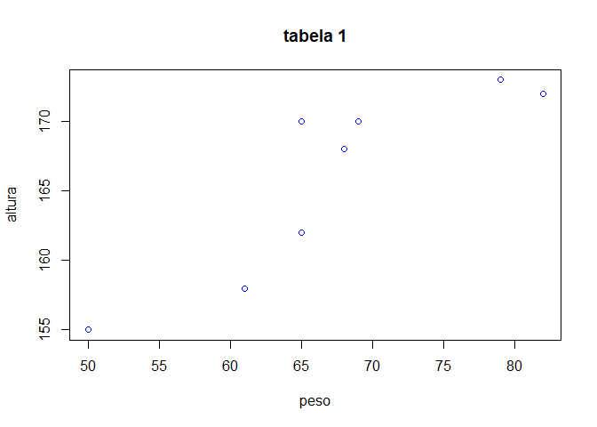

Atividade Avaliativa I
================
Michely Santos piropo
Estat 2020.1

**Questão 01** O seguinte Box Plot fornece informações sobre a
distribuição de pesos das malas em um avião.

**a)**

Ele não calculou o intervalo fora do block post, só calculou o intervalo
entre q1 e q2, por isso esta incorreto.

**b)**

15+2= 17

**c)**

23-10= 13

**d)**

55x24/240 = 5,5

**Questão 02** Uma prova foi aplicada em duas turmas distintas. Na
primeira, com 30 alunos, a média aritmética das notas foi 6.40. Na
segunda, com 50 alunos, foi 5.20. A média aritmética das notas dos 80
alunos foi:

6,40x30 + 5,20x50 = 192+260/80 = 5,65

resposta alternativa a)

**Questão 03** Considere os dados abaixo, onde a variável de interesse,
X, é batimentos cardíacos por minuto (BAT/min).

**a)**

``` r
dados <- c(68,70,72,58,90,110,68,70,72,80,
             80,67,90,94,100,80,75,79,84,90)
  (110:58)
```

    ##  [1] 110 109 108 107 106 105 104 103 102 101 100  99  98  97  96  95  94  93  92
    ## [20]  91  90  89  88  87  86  85  84  83  82  81  80  79  78  77  76  75  74  73
    ## [39]  72  71  70  69  68  67  66  65  64  63  62  61  60  59  58

**b)**

media = 79,85

mediana = 79,5

primeiro quartil = 70

terceiro quartil = 90

desvio padrão = 4,46

**c)**

Não, ambos os valores da media e mediana são proximos.

``` r
hist(dados)
```

<!-- -->

``` r
hist(dados, ylab = "Frequência Absoluta", xlab = "BAT/min", col = "blue",bolder = FALSE, main = "Batimentos Cardíacos")
```

    ## Warning in plot.window(xlim, ylim, "", ...): "bolder" não é um parâmetro gráfico

    ## Warning in title(main = main, sub = sub, xlab = xlab, ylab = ylab, ...):
    ## "bolder" não é um parâmetro gráfico

    ## Warning in axis(1, ...): "bolder" não é um parâmetro gráfico

    ## Warning in axis(2, ...): "bolder" não é um parâmetro gráfico

<!-- -->

**Questão 04** No repositório de dados da disciplina no GitHub,
dados\_csv, analise o conjunto de dados frango\_dieta.csv.

**a)**

Não pois ele é apresentado por 579 linhas, e um arquivo tidy e
apresentado por 10.

**b)**

``` r
mean(frango_dieta$peso)
```

    ## [1] 121.8183

**c)**

``` r
sd(frango_dieta$peso)
```

    ## [1] 71.07196

**d)**

Tempo, Peso, Frango, Dieta = Quantitativo Discreto

**Questão 05**

eu usaria a média pois, a média se baseia em todos os numeros da curva,
enquanto a mediana se baseia apenas no central e nesse grafico há uma
drastica subida e decida no inicio, então a media é o mais correto a se
considerar.

``` r
#---------------------------------------------------------
N <- 1000
x <- rnbinom(N, 4, .5)
hist(
x,
xlim = c(min(x), max(x)),
probability = T,
nclass = max(x) - min(x) + 1,
col = 'lightblue', xlab = ' ', ylab = ' ', axes = F,
main = 'Positive Skewed'
)
lines(density(x, bw = 1), col = 'red', lwd = 3)
```

<!-- -->

``` r
#---------------------------------------------------------
```

**Questão 06** Considere o banco de dados dados\_co2.csv

**a)**

**b)**

Não, pois o tidy apresenta 10 linhas e a tabela em questão 39.

**c)**

``` r
dados_co2 %>%                
  pivot_longer(
    1:13,                
    names_to = "ano",    
    values_to = "co2" 
  )
```

    ## # A tibble: 507 x 2
    ##    ano     co2
    ##    <chr> <dbl>
    ##  1 ano   1959 
    ##  2 jan    315.
    ##  3 fev    316.
    ##  4 mar    316.
    ##  5 abr    318.
    ##  6 mai    318.
    ##  7 jun    318 
    ##  8 jul    316.
    ##  9 ago    315.
    ## 10 set    314.
    ## # ... with 497 more rows

**d)**

``` r
dados_co2_tidy <- dados_co2 %>%  
  pivot_longer(
    !ano,
    names_to = "mes",
    values_to = "ppm"
  )
```

**e)**

``` r
co2_tidy <-  read_csv("dados/tidy/dados_co2_tidy.csv")
```

    ## New names:
    ## * `` -> ...1

    ## Rows: 468 Columns: 4

    ## -- Column specification --------------------------------------------------------
    ## Delimiter: ","
    ## chr (1): mes
    ## dbl (3): ...1, ano, ppm

    ## 
    ## i Use `spec()` to retrieve the full column specification for this data.
    ## i Specify the column types or set `show_col_types = FALSE` to quiet this message.

``` r
View(co2_tidy)

co2_tidy %>% glimpse()
```

    ## Rows: 468
    ## Columns: 4
    ## $ ...1 <dbl> 1, 2, 3, 4, 5, 6, 7, 8, 9, 10, 11, 12, 13, 14, 15, 16, 17, 18, 19~
    ## $ ano  <dbl> 1959, 1959, 1959, 1959, 1959, 1959, 1959, 1959, 1959, 1959, 1959,~
    ## $ mes  <chr> "jan", "fev", "mar", "abr", "mai", "jun", "jul", "ago", "set", "o~
    ## $ ppm  <dbl> 315.42, 316.31, 316.50, 317.56, 318.13, 318.00, 316.39, 314.65, 3~

``` r
#-------------------------------------------
co2_tidy %>% # conjunto de dados
group_by(ano) %>% # agrupa por ano
summarise(media = round(mean(ppm), 2)) %>% # calcula a média da variavel ppm em cada grupo
ggplot(aes(ano, media, group = 1)) + # cria o gráfico
geom_line(color = "blue", size = 1)
```

<!-- -->

``` r
#-------------------------------------------
```

**Questão 07** Considere a Tabela 1:

**a)**

``` r
tibble(
  nome = c("Ana", "Ludimilla", "Cristina", "Tereza", "Patrícia", "Mariana", "Ana Paula", "Dirce"),
  altura = c("155", "158", "162", "168", "170", "170", "172", "173"),
  peso = c("50", "61", "65", "68", "69", "65", "82", "79")
)
```

    ## # A tibble: 8 x 3
    ##   nome      altura peso 
    ##   <chr>     <chr>  <chr>
    ## 1 Ana       155    50   
    ## 2 Ludimilla 158    61   
    ## 3 Cristina  162    65   
    ## 4 Tereza    168    68   
    ## 5 Patrícia  170    69   
    ## 6 Mariana   170    65   
    ## 7 Ana Paula 172    82   
    ## 8 Dirce     173    79

**b)**

peso e altura.

**c)**

Peso: Mediana= 66,5 Média= 67,375 Desvio padrão= 9,39

Altura: Mediana= 169 Média = 166 Desvio padrão= 6,34

**d)**

Conforme a altura aumenta, o peso tende a aumentar proporcionalmente.

``` r
plot(tabela_1$"peso", tabela_1$"altura" , col = "blue", xlab = "peso", ylab = "altura", main = "tabela 1")
```

<!-- -->
